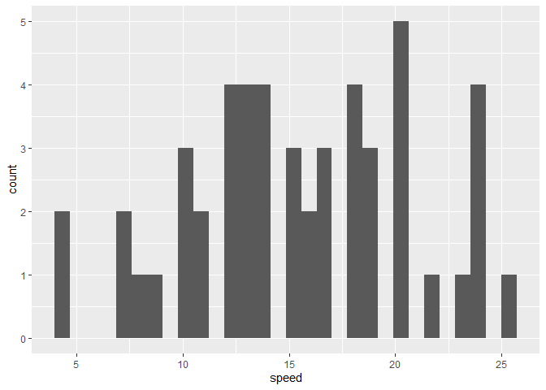

R Notebook
================

#### this is my attempt

# its not going well\!\!

# really…

    ## [1] "speed" "dist"

    ## `stat_bin()` using `bins = 30`. Pick better value with `binwidth`.

<!-- --><!-- -->
